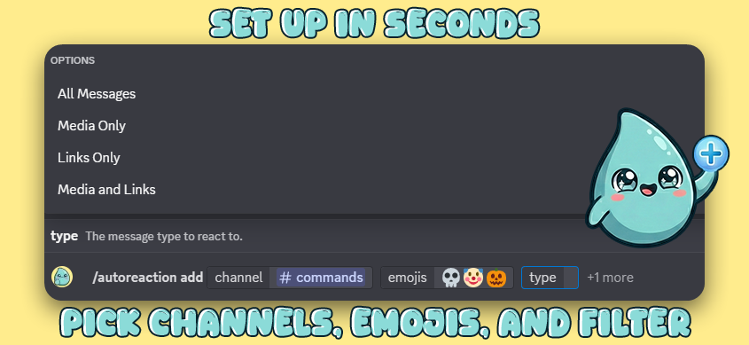
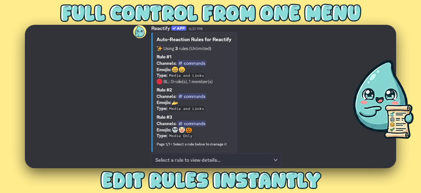
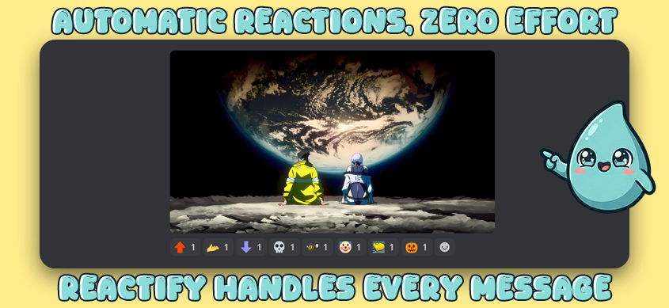

  

<h1 align="center">Reactify</h1>

  <strong>Automatic emoji reactions for your Discord server.</strong> 
  Set up rules, pick channels and emojis, filter by message type - done in seconds.

  <a href="https://discord.com/oauth2/authorize?client_id=1469692518567514286">Add to Server</a> ·
  <a href="https://discord.gg/sqhnaVkCcd">Support Server</a> ·
  <a href="https://discord.com/application-directory/1469692518567514286">App Directory</a> ·
  <a href="https://cyberliquid.github.io/reactify/privacy-policy.html">Privacy</a> ·
  <a href="https://cyberliquid.github.io/reactify/terms-of-service.html">Terms</a>

---

> **Reactify is newly launched!** If you run into any issues or have suggestions, join our [Support Server](https://discord.gg/sqhnaVkCcd).

  
  
  

## Quick Start

1. [Invite Reactify](https://discord.com/oauth2/authorize?client_id=1469692518567514286)
2. `/autoreaction add` - pick channels, emojis, and filter type
3. That's it - new messages get reactions automatically

## Commands

| Command | Description |
|---------|-------------|
| `/autoreaction add` | Create a reaction rule |
| `/autoreaction edit` | Edit an existing rule (emojis, filter, channels) |
| `/autoreaction list` | View, edit, and delete rules interactively |
| `/autoreaction remove` | Bulk-delete rules |
| `/autoreaction whitelist` | Allow specific roles/members ⭐ |
| `/autoreaction blacklist` | Block specific roles/members ⭐ |
| `/autoreaction keyword` | React only on matching words ⭐ |
| `/autoreaction-admin manage` | Delegate rule management to roles |
| `/premium` | View status or upgrade |
| `/help` | Get support server and bot links |

⭐ Premium feature - requires **Manage Server** or a manager role set via `/autoreaction-admin manage`.

## How Rules Work

Each rule has: **channels** + **emojis** + **filter type**.

| Filter | Triggers on |
|--------|-------------|
| All | Every message |
| Media | Images, videos, GIFs |
| Links | URLs |
| Media + Links | Either |

One rule can cover **multiple channels** at once. Multiple rules can overlap - emojis are deduplicated and capped per message.

### Supported Channel Types

- Text channels
- Announcement channels
- Forum channels - target the forum, reactions apply to all posts and replies inside it
- Threads - if a thread's parent channel has a rule, reactions work there too

## Free vs Premium

| | Free | Premium |
|--|------|---------|
| Rules | 3 | 50 |
| Emojis per rule | 5 | 10 |
| Max emojis per message | 5 | 10 |
| Channels per rule | ∞ | ∞ |
| Whitelist / Blacklist | x | ✅ |
| Keyword Filters | x | ✅ |
| Pause / Resume Rules | ✅ | ✅ |

**$3.99/month** - billed through Discord. Run `/premium` to upgrade.

## FAQ

**Forum channels?** Yes. Target a forum and Reactify reacts to all posts and replies inside it. Threads under regular channels work too.

**Custom emojis?** Yes, from servers Reactify is in. Nitro-only emojis won't work.

**Bot messages?** Always ignored - no reaction loops.

**Multiple rules on one channel?** Emojis combine and cap at your tier limit per message.

**Hit the rule limit?** Existing rules keep working. Remove one or upgrade.

**What happens if I cancel premium?** Your rules stay saved, but only the first 3 will be active. Whitelists, blacklists, and keyword filters become inactive (shown in the rule list). Upgrade again anytime to re-enable everything.

**Clear all rules?** Open `/autoreaction list`, click **Clear All Rules** at the bottom, then **Confirm Clear All**. This permanently removes all rules at once.

**Pause a rule?** Open `/autoreaction list`, select a rule, and click ⏸ Pause. Resume anytime.

**Something broken?** Join our [Support Server](https://discord.gg/sqhnaVkCcd) - we're active and fixing issues fast.

**Privacy?** No message content is stored or logged. [Privacy Policy](https://cyberliquid.github.io/reactify/privacy-policy.html)

---

  <a href="https://discord.com/oauth2/authorize?client_id=1469692518567514286">Add to Server</a> ·
  <a href="https://discord.gg/sqhnaVkCcd">Support Server</a> ·
  <a href="https://discord.com/application-directory/1469692518567514286">App Directory</a>
    
  © 2026 CyberLiquid

